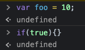
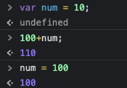

## 5장 표현식과 문

### 5.1 값
- 값: 표현식이 평가되어 생성된 결과.

```js
// 10 + 20은 평가되어 숫자 값 30을 생성한다.
10 + 20; //30
```

- 모든 값은 데이터 타입을 가진다.
- 값은 메모리에 저장될 때 2진수(bit의 나열)로 저장된다.
- 값은 데이터 타입에 따라 다른 값을 가진다.
- 메모리에 저장된 값 0100 0001은 숫자로는 65, 문자로는 ‘A’로 해석된다.

---
### 5.2 리터럴
- 리터럴: 사람이 이해할 수 있는 문자 또는 미리 약속된 기호로 값을 생성하는 표기법. (자바스크립트 엔진에게 해당 데이터타입의 값을 만들라고 명령)
- 리터럴은 **런타임**에 평가되어 값을 생성한다.
- 리터럴도 **표현식**이다. (값으로 평가될수 있는 모든 문은 표현식이다.)

---
### 5.3 표현식
- 표현식: 값으로 평가될 수 있는 문(`statement`). 즉 값을 담고 있는 코드(문)는 표현식이다.
- 표현식은 평가되어 값을 생성한다.
#### 유의사항

- 연산자 단독으로는 피연산자가 없으므로 표현식이 될 수 없다. 단항 또는 좌항과 우항에 숫자 값이 위치해야 값으로 평가되어 표현식이 된다.
- 함수를 호출하면 반환값을 가지므로 표현식이다.
- 할당문도 표현식이다.

---
### 5.4 문
- 문: 프로그램을 구성하는 기본 단위이자 최소 실행 단위
- 문은 여러 **토큰**들로 구성된다.
    - 토큰: 문법적으로 더 이상 나눌 수 없는 코드의 기본 요소.(키워드, 식별자, 연산자, 리터럴, 세미콜론, 마침표 등)
- 문은 **세미콜론**으로 끝나야 한다. 그러나 여러 문들을 하나의 실행단위로 묶은 코드블럭({ ... }) 뒤에는 세미콜론을 생략한다.


---
### 5.5 세미콜론과 세미콜론 자동 삽입 기능
- 세미콜론(;)은 문의 종료를 나타낸다.

> 💡 세미콜론을 생략하여도, 세미콜론 자동 삽입 기능(ASI)이 암묵적으로 수행된다.

> 💡 아래와 같이 ASI와 개발자의 예측이 일치하지 않는 경우가 있으므로 일반적으로 세미콜론 사용이 더 권장된다.

```js
function foo () {
	return
	{}
}

// ASI 동작 결과: return; {};
// 개발자의 예측: return {};

console.log(foo()); // return; 이므로 undefined 반환
```

---
### 5.6 표현식인 문과 표현식이 아닌 문
- 변수 선언문과 조건문은 값으로 평가될 수 없으므로 표현식이 아니다.
- 변수 할당문은 표현식이다.

#### 표현식인지 아닌지 판별하기: 변수에 할당시 문법 에러 여부
```js
var x;
x = 100; 

// 변수 선언문 할당시 에러 발생. 따라서 표현식이 아님.
var foo = var x; // Uncaught SyntaxError: Unexpected token 'var'

// 변수 할당문 할당시 값을 가지므로 표현식이다.
var foo = x = 100;
foo; // 100
x; // 100
```
#### 완료 값 ≠ 평가된 값

크롬 개발자 도구에서 표현식이 아닌 문을 실행하면 언제나 undefined를 출력하는데, 이를 완료 값이라고 한다.
완료값은 표현식의 평가 결과가 아니다. 따라서 다른 값과 같이 변수에 할당할 수 없고 참조도 할수 없다.


크롬 개발자 도구에서 표현식인 문을 실행하면 언제나 평가된 값을 반환한다.
