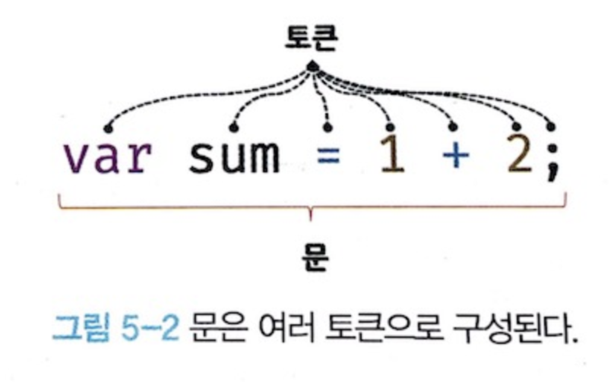
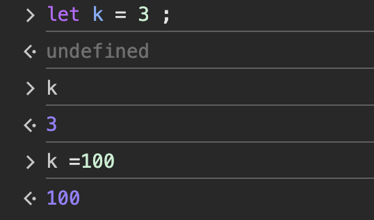

## 표현식(expression)과 문(statement)

### 5.1 값

- 값은 식의 결과로 평가될 수 있는 것

```js
10 + 20; // 30
```

- 모든 값은 데이터 타입을 가지며, 데이터 타입은 값의 종류를 나타낸다.
- ex) ```01000110(2진수)```는 70이라는 숫자 값이면서, 문자로 해석하면 'F'이다. 


### 5.2 리터럴(literal)

- 리터럴은 사람이 이해할 수 있는 문자 또는 약속된 기호를 사용해 값을 생성하는 표기
- 그래서 이게 무슨 뜻인지에 대해서는 리터럴 -> 값을 생성하기 위한 표기법이라고 이해했다.

### 5.3 표현식(Expression)

> **정의**: 값으로 평가될 수 있는 문(statement)

- 표현식은 값으로 평가될 수 있는 문(statement)입니다.
- 표현식이 평가되면 새로운 값을 생성하거나 기존 값을 참조합니다.
- **예시**: `10 + 20`은 `30`이라는 숫자 값으로 평가됩니다.

#### 리터럴과 표현식의 차이점
- **리터럴**: 값의 생성을 위한 표기법입니다.
- **표현식**: 값으로 평가될 수 있는 문입니다. 표현식은 리터럴을 포함할 수 있으며, 복잡한 연산의 결과로도 나타날 수 있습니다.


### 5.4 문(statement)

> **정의**: 프로그램을 구성하는 기본 단위이자 최소 실행 단위

문은 여러 토큰으로 구성되며, 토큰은 문법적인 의미를 가집니다. 

- **토큰**:문법적인 의미를 가진 코드의 최소 단위 (ex. 키워드, 식별자, 연산자, 리터럴 등)




#### 문(statement)의 종류

- **선언문(Declaration statement)**
- **할당문(Assignment statement)**
- **조건문(Conditional statement)**
- **반복문(Loop statement)**

### 5.5 세미콜론(;)과 세미콜론 자동 삽입 기능(ASI)

자바스크립트 엔진은 자동으로 세미콜론을 삽입해주는 기능을 가지고 있어서, 세미콜론을 생략해도 문제가 없다. 

다만 몇몇의 상황에서는 자동 삽입 기능이 원활하게 동작하지 않을 수 있으므로, 세미콜론을 명시적으로 작성하는 것이 좋다.

> 자동 삽입 기능이 원활하게 동작하지 않는 상황 예시
```js
function foo() {
    return
    {}
    // ASI에 의해 아래와 같이 해석된다.
    // return;
    // {};
    // 우리의 기대
    // return {};
}
```
TC39(ECMA Script)에서도 세미콜론을 생략하지 않는 것을 권장하고 있다.


### 5.6 표현식인 문과 표현식이 아닌 문

- **표현식인 문**: 값으로 평가될 수 있는 문
- **표현식이 아닌 문**: 값으로 평가될 수 없는 문

표현식과 문을 구분하는 기준 -> 값으로 평가될 수 있는가?

```js
// 표현식인 문
var sum = 10 + 20;

// 표현식이 아닌 문
var x;
```

💡Tip 
개발자 도구에서 표현식이 아닌 문을 실행하면 `undefined`가 출력된다.



