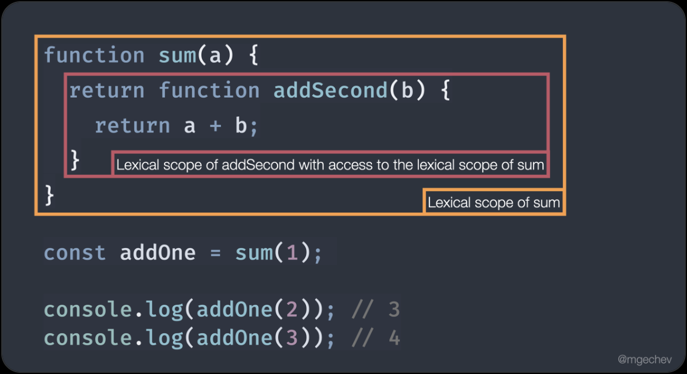
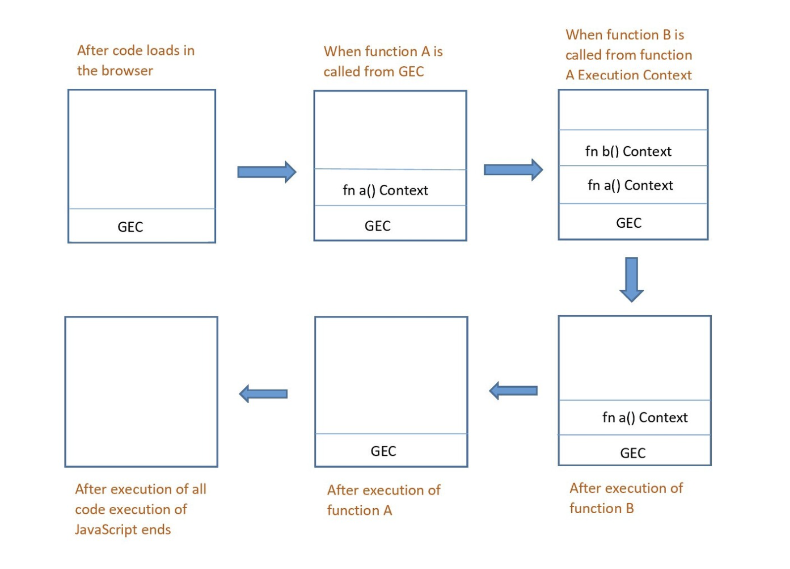
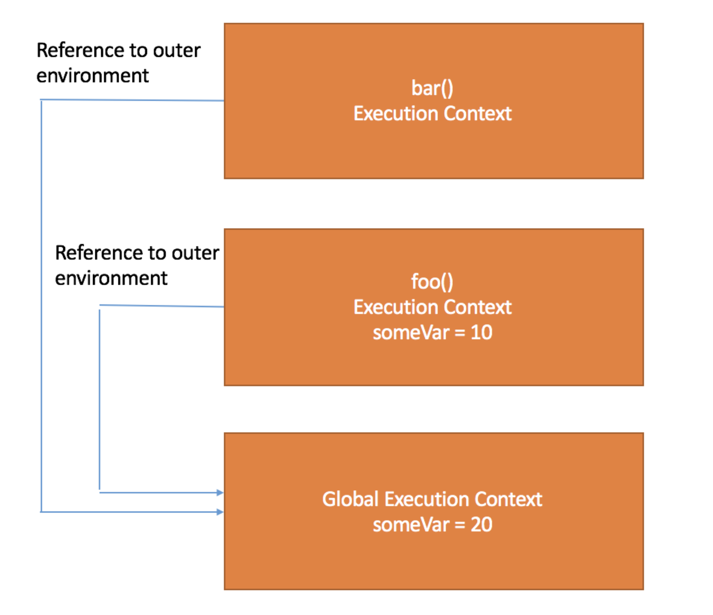

## 13장 스코프

스코프란? -> 변수의 유효범위

```js
    var a = 1;

    if (true) {
        var b = 2; 
        if (true) {
            var c = 3;
        }
    }

    function k() {
        var d = 4;
        function e() {
            var e = 5;
        }
    }

    console.log(a); // 1
    console.log(b); // 2
    console.log(c); // 3
    console.log(d); // ReferenceError: d is not defined
    console.log(e); // ReferenceError: e is not defined

```

- 변수의 유효범위는 함수 정의가 실행될 때 결정된다.
- 변수는 자신이 선언된 위치에 의해 자신이 유효한 범위, 즉 스코프가 결정된다.
- 모든 식별자(변수 이름, 함수 이름, 클래스 이름 등)는 자신이 선언된 위치에 의해 자신의 유효범위가 결정된다.

```js
    var x = 'global';

    function foo() {
        var x = 'local';
        console.log(x); // local
    }

    foo();

    console.log(x); // global
```

#### 코드의 문맥과 환경

- 렉시컬 환경: 식별자와 식별자에 바인딩된 값, 그리고 상위 스코프에 대한 참조를 기록하는 자료구조
- 렉시컬 환경은 스코프와 식별자 결정에 필요한 정보를 제공한다. ( 코드의 문맥과 환경을 제공한다. )



<br/>

```js
    var x = 1;

    function foo() {
        var x = 10;
        bar();
    }

    function bar() {
        console.log(x);
    }

    foo(); // 1
    bar(); // 1
```

### 13.2 스코프의 종류

<!-- 전역 , 지역스코프 비교하는 테이블생성 항목은 구분 ,설명, 스코프 ,변수 테이블 -->

| 구분 | 설명 | 스코프 | 변수 |
|:---:|:---:|:---:|:---:|
| 전역 | 코드의 가장 바깥 영역, 전역에 선언된 변수는 전역 스코프를 갖는다. | 전역 스코프 | 전역 변수 |
| 지역 | 함수 몸체 내부, 함수 몸체 내부에 선언된 변수는 지역 스코프를 갖는다. | 지역 스코프 | 지역 변수 |

```js
    var x = 'global';

    function foo() {
        var x = 'local';
        console.l  g(x); // local
    }

    foo();

    console.log(x); // global
```

- 지역변수는 자신의 지역 스코프와 하위 스코프에서 유효하다.

------

### 13.3 스코프 체인

- 스코프 체인: 일종의 리스트로서 전역 객체와 중첩된 함수의 스코프의 레퍼런스를 차례로 저장하고, 의미 그대로 각각의 스코프가 어떻게 연결되어 있는지를 나타낸다.

[실행 컨텍스트](./실행컨텍스트란?.md)



- 중첩 함수 : 함수 내부에 중첩된 함수
- 외부 함수 : 중첩 함수를 포함하는 함수

- 자바스크립트 엔진은 변수를 참조할 때 스코프 체인을 통해 변수를 찾는다.

```js
    var x = 1;

    function foo() {
        var x = 10;
        bar();
    }

    function bar() {
        console.log(x);
    }

    foo(); // 1
    bar(); // 1
```



> [scope관련 블로그](https://velog.io/@alsejr1004/JS-Scope)
> [SCOPE CHAIN이란?](https://ljtaek2.tistory.com/140)


#### 13.3.1 스코프 체인에 의한 변수 검색

- 변수를 참조할 때 엔진은 스코프 체인을 통해 변수를 찾는다.
- 변수를 참조할 때 스코프 체인을 통해 변수를 찾는다.
- 상위 스코프에서 유효한 변수는 하위 스코프에서 자유롭게 참조할 수 있다.
- 반대로 -> 하위 스코프에서 유효한 변수를 상위 스코프에서 참조할 수 없다.

------

### 13.4 함수 레벨 스코프

- 함수 레벨 스코프: 함수 코드 블록 내에서 선언된 변수는 함수 코드 블록 내에서만 유효하다.

### 13.5 렉시컬 스코프

- 렉시컬 스코프: 함수를 어디서 호출했는지가 아니라 어디에 선언하였는지에 따라 결정된다.


```js
var x = 1;

function foo() {
    var x = 10;
    bar();
}

function bar() {
    console.log(x);
}
foo(); // 1
bar(); // 1
```


>[참고자료](https://poiemaweb.com/js-scope)
>[렉시컬 스코프](https://velog.io/@chojs28/%EB%A0%89%EC%8B%9C%EC%BB%AC-%EC%8A%A4%EC%BD%94%ED%94%84%EC%99%80-%ED%81%B4%EB%A1%9C%EC%A0%80-%EA%B7%B8%EB%A6%AC%EA%B3%A0-%EC%BB%A4%EB%A7%81)


> 이후에 클로저(24장)때 더 자세히 다룬다고 한다. 
