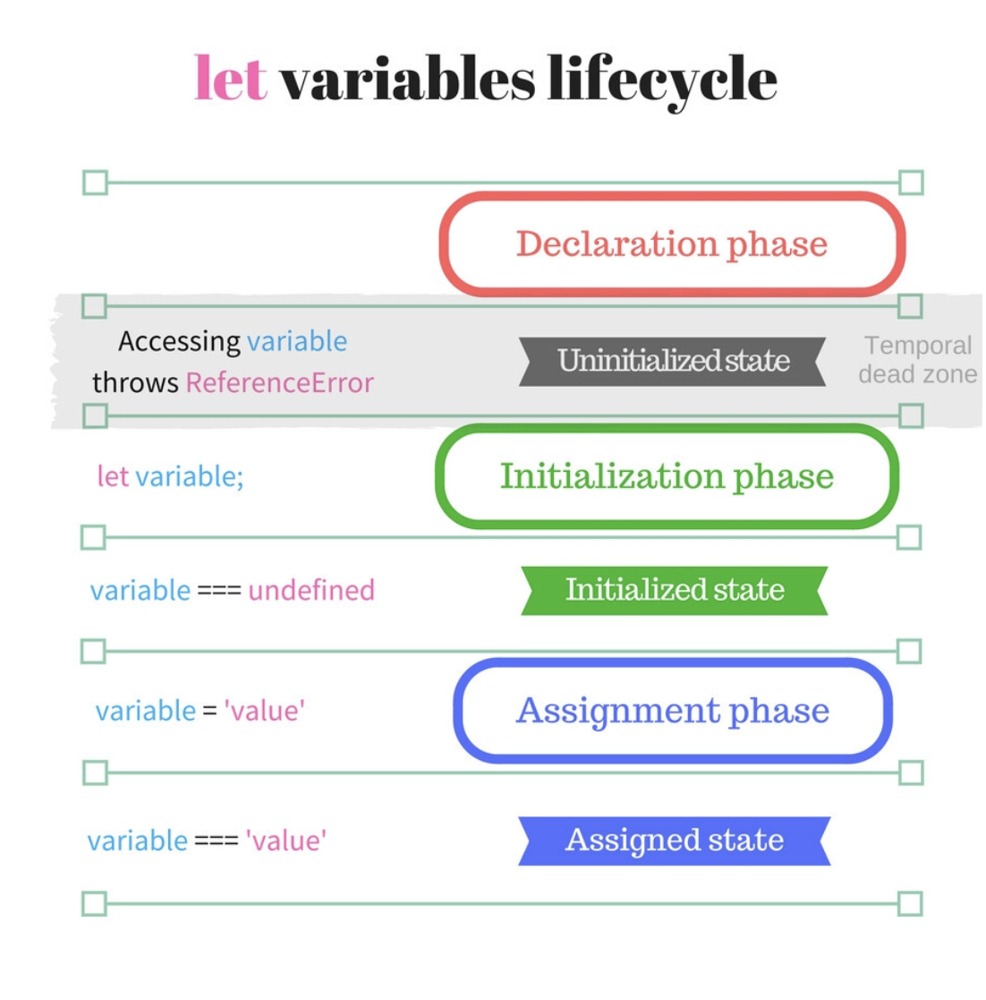

## 15장 - let,const 키워드와 블록 레벨 스코프

### 15.1 var 키워드로 선언한 변수의 문제점

- ES6 이전에는 var 키워드로 변수를 선언했다.
- var 키워드로 선언한 변수는 함수 레벨 스코프를 가진다.
- 여러 문제점이 있어 ES6에서 let, const 키워드를 도입했다.

> var 사용시에 발생할 수 있는 문제점

#### \_\_변수 중복 선언 허용 

- let, const 키워드는 변수 중복 선언을 허용하지 않는데, 유일하게 var 키워드만 중복 선언을 허용한다!
- 이는 이미 선언된 변수를 덮어쓰는 문제를 발생시킬 수 있다. 

```js
var x = 1
var x = 2
console.log(x) // 2
```

#### \_\_함수 레벨 스코프

- var 키워드로 선언한 변수는 함수 레벨 스코프를 가진다.
- 함수 외부에서 선언한 변수는 코드 블록 내에서 선언해도 전역 변수로 선언된다.

```js
var i = 10

for(var i = 0; i < 5; i++){
    console.log(i) // 0 1 2 3 4
}

console.log(i) // 5
```

#### \_\_변수 호이스팅

- var 키워드로 선언한 변수는 변수 호이스팅이 발생한다.
> <span style="font-weight:700; color:#065D20">다시 한번 호이스팅이란? </span> <br/> 변수 선언문이 코드의 선두로 끌어 올려진 것처럼 동작하는 특성을 말한다.

```js
console.log(foo) // undefined  -> 변수 호이스팅 발생 referror가 아니라 undefined가 나온다. -> 이미 선언을 진행한 상태이기 때문에
foo = 123
console.log(foo) // 123
var foo;
```

-------

### 15.2 let 키워드

- let 키워드는 블록 레벨 스코프를 가진다.
> <span style="font-weight:700; color:#065D20">블록 레벨 스코프</span> <br/>코드 블록 내에서 선언한 변수는 코드 블록 내에서만 유효하다는 것을 의미한다.


#### \_\_변수 중복 선언 금지

#### \_\_블록 레벨 스코프

- let 키워드로 선언한 변수는 블록 레벨 스코프를 가진다.
- 코드 블록 내에서 선언한 변수는 코드 블록 내에서만 유효하다.

```js
let i = 10

for(let i = 0; i < 5; i++){
    console.log(i) // 0 1 2 3 4
}

console.log(i) // 10
```


#### \_\_변수 호이스팅

- let 키워드로 선언한 변수는 변수 호이스팅이 발생하지만, TDZ(Temporal Dead Zone)에 의해 초기화가 이루어지기 전까지 변수를 참조할 수 없다.

<span style="font-weight:700; color:#065D20">let키워드의 LifeCycle</span> 
1. 선언 단계(Declaration phase)
2. 초기화 단계(Initialization phase)
3. 할당 단계(Assignment phase)

>```var```은 선언 단계와 초기화 단계가 동시에 이루어지지만, ```let```은 선언 단계와 초기화 단계가 분리



<span style="font-weight:700; color:#065D20">TDZ(Temporal Dead Zone)이란?</span> 
- 변수를 선언하기 전에 변수를 참조하면 참조 에러가 발생하는 것을 의미한다.
- let 키워드로 선언한 변수는 선언 단계에서 초기화가 이루어지기 전까지 TDZ에 빠진다. 
    호이스팅이 되었지만, 초기화가 이루어지기 전까지 변수를 참조할 수 없다.

<span style="font-weight:700; color:#065D20;"> TDZ상태일때는 메모리할당이 일어나는가? </span>

<p style="font-size: 13px; color:#378CFA;">
TDZ (Temporal Dead Zone) 상태일 때의 변수 처리는 자바스크립트 엔진의 구현에 따라 다를 수 있지만, 일반적으로 메모리 할당의 관점에서 이해할 수 있습니다. let과 const로 선언된 변수는 호이스팅될 때 스크립트 실행 환경의 변수 환경에 등록됩니다. 이 때, 실제 메모리 할당이 이루어지며, 변수에 접근하려고 하면 JavaScript 엔진이 이 변수가 초기화되지 않았다는 것을 알고 있기 때문에 참조 에러(ReferenceError)를 발생시킵니다.
</p>

```js
console.log(foo) // ReferenceError: Cannot access 'foo' before initialization
let foo = 123
console.log(foo) // 123
```

------

### 15.3 const 키워드

- 대체로 변경되지 않는 값을 저장하기 위해 사용한다. - 재할당이 불가능하기 때문
- 선언과 동시에 초기화가 이루어져야 한다.

-----

### 15.4 var, let, const 비교

- ```ES6```이후라면 ```let```과 ```const```를 사용하는 것이 좋다.
- ```var```는 사용하지 않는 것이 좋다.
- 읽기전용 상수를 선언할 때는 ```const```를 사용한다.
- 재할당 여부/변수의 스코프에 따라 ```let```과 ```const```를 선택하면 된다.
